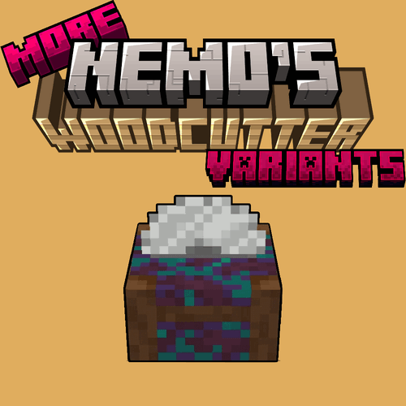

#  More Nemoʼs Woodcutter Variants
> 
>
> A simple mod adding wood variants for [Nemoʼs Woodcutter](https://www.modrinth.com/mod/Nemos-Woodcutter) block.

### Compatibility

- Minecraft: `1.20.1`, `1.21(.1)`, `1.21.4`~`1.21.8`
- Mod Loader: _Fabric_
- Requires: [`Fabric API`](https://modrinth.com/mod/fabric-api), [ `Nemoʼs Woodcutter`](https://www.modrinth.com/mod/Nemos-Woodcutter)

### ᴬ⃯ ᵦ⃔ Translations

Currently available in:
- English

Want to help translate? Feel free to open a PR to the **default branch (`1.21(.1)`)**.

### Changelog History

<!--CHANGELOG:START-->
## 1.14.0:
### NOTE: Requires **Nemoʼs Woodcutter** `1.14`
> The only currently available version of **Nemoʼs Woodcutter** `1.14⁺` requires 1.21.8.
For all other versions (1.21.4 - 1.21.7), this can be considered a pre-emptive update.  
> Come back here, once **Nemoʼs Woodcutter** `1.14⁺` has been released for your Minecraft version.
- Adapt **Nemoʼs Woodcutter**'s versioning  
  -> As a result, this update requires at least **Nemoʼs Woodcutter** `1.14`
- `1.21.8`: First version compatible with any `1.21.8` version of **Nemoʼs Woodcutter**

---

### 1.1.5:
- Make Nemoʼs Woodcutter dependency check more comprehensive
### 1.1.4:
- Significantly improve texture compression to decrease mod file size by over 70% (~350KB --> ~100KB)
### 1.1.3:
- `1.21.4(5)`: Update to 1.21.4, 1.21.5
### 1.1.2:
- `1.20.1`-`1.21.1`: Fix Mixin declaration from version 1.1.1 preventing the game from starting (1.21.2/3 was not affected)
### 1.1.1:
- `1.21.3`: Update to 1.21.3, added _**Pale Oak** Woodcutter_
- _**Dark Oak** Woodcutter_ recipe now accepts all blocks of the **Dark Oak** Logs tag (Log, Stripped Log, Wood, Stripped Wood), not just the regular Log block (in line with all other recipes for the _Woodcutter_ and its variants)
## 1.1.0:
- Fix a bug that made the woodcutter variant blocks not drop when mined

<!--CHANGELOG:END-->
> _`The section above is automatically updated with each new release and only includes already published releases.`_
---
#### Support/Contact
- Suggestions? Questions? Bug reports?  
  Feel free to [open an issue](https://github.com/pnk2u/More-Frame-Variants/issues)!  
  &nbsp;  
  You can also contact me via email at [contact@pnku.de](mailto:contact@pnku.de) or join the [Discord](https://dsc.lieonlion.dev) and contact me there.
